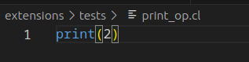
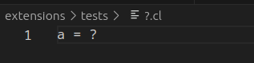
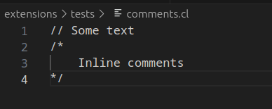
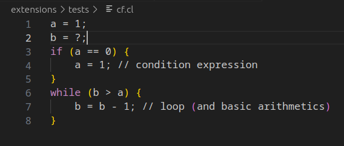
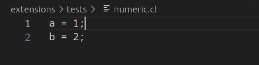
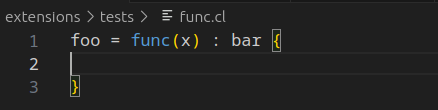

# LabaCL highlight

## Introduction to LabaCL:

```
// comments
/* 
    inline comments
*/
a = 1; // variable declaration and initialization
b = ?; // put b from stdin (? is an operator)
if (a == 0) {
    a = 1; // condition expression 
}
while (b > a) {
    b = b - 1; // loop (and basic arithmetics)
} 

print_b = func(b) : printing { // function decalration (`printing` is the second name)
    print(b); // print b to stdout (print is an operator)
} 

printing(b);

// result: 1 (or infinity loop, if b < a from stdin>)
```


We expect the highlighting of:
* both of comment types
* all the operators 
* numbers
* condition statements
* func

## The current state of vscode highlight extension: 
### Case 1 (tests/print_op.cl): 


As we can see, the `print` operator highlights successfully.

#### Result: Test passes
---

### Case 2 (tests/?_op.cl): 


As we can see, the `?` operator doesn't highlight.

#### Result: Test fails
---

### Case 3 (tests/comments.cl): 


As we can see, the `//` and `/* */` doesn't highlight.

#### Result: Test fails
---

### Case 4 (tests/cf.cl): 


As we can see, the control-flow keywords `if` and `while` highlights successfully.
Also, all brackets highlights as well

#### Result: Test passes
---

### Case 5 (tests/numeric.cl): 


As we can see, the control-flow keywords numeric values doesn't highlight.

#### Result: Test fails
---

### Case 6 (tests/func.cl): 


As we can see, the keyword `func` highlights successfully.

#### Result: Test passes
---

# Total result: 

According to the specification above, there are three unsupported features in current version of VSCode extension